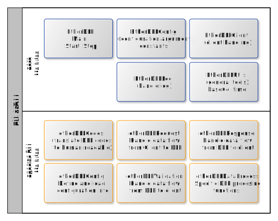

<!-- Improved compatibility of back to top link: See: https://github.com/othneildrew/Best-README-Template/pull/73 -->

<!-- PROJECT SHIELDS -->
<!--
*** based on https://github.com/othneildrew/Best-README-Template
*** Reference links are enclosed in brackets [ ] instead of parentheses ( ).
*** See the bottom of this document for the declaration of the reference variables
*** for contributors-url, forks-url, etc. This is an optional, concise syntax you may use.
*** https://www.markdownguide.org/basic-syntax/#reference-style-links
-->
<!-- TABLE OF CONTENTS -->

  
Table of Contents

  <ol>
    <li><a href="#about-etherdll">About EtherDLL</a></li>
    <li><a href="#detailed-description">Detailed Description</a></li>
        <ul>
            <li><a href="#core-modules">Core Modules</a></li>
            <li><a href="#specific-modules">Specific Modules</a></li>
            <li><a href="#required-specific-functions-and-data-types">Required Specific Functions and Data Types</a></li>
        </ul>>
    <li><a href="#getting-started">Getting Started</a></li>
    <li><a href="#contributing">Contributing</a></li>
    <li><a href="#license">License</a></li>
    <li><a href="#additional-references">Additional References</a></li>
  </ol>

<!-- ABOUT THE PROJECT -->
# About EtherDLL

  

The is a console application that provides a TCP/IP Socket API to local host services.

This enables the integration of restricted and legacy Windows services through TCP/IP, allowing the development of cross platform solutions, either locally, such as a x64 application accessing a x86 DLL API, or remotely, such as a web application accessing a windows local service through the network.

Core modules and functions provide methods for client communication through TCP/IP sockets using JSON formatted messages and additional reusable componentes for logging, runtime configuration and general utilities. These core modules can be reused in different projects.

The communication with the DLL API is done through callback functions and specific C++ methods. Thus the program must be compiled with the specific header files and linked with the DLL files in order to actually provide the intended service.

The application was originally designed to work with the DLL provided by TCI SPX Inc for their [Spectrum Monitoring Stations](https://www.tcibr.com/spectrum-monitoring-systems/), using Visual Studio 2022 as IDE and Windows as operating system in a x86 architecture. The solution itself follows the C++17 standard. For testing purposes of this initial integration, a test client in matlab was also developed. Some of the components used in this example are dependent on the manufacturer's SDK and licensing, thus they are not included in this repository.

Additional examples are intended to be provided in the future.

    
      

<!-- Detailed Description -->
# Detailed Description

The following diagram illustrates how EtherDLL provides the interface between the client and the DLL using multiple threads and message queues.

There are core modules that are independent of the specific DLL API, and specific modules that handle the communication with the DLL API.

The naming of the specific modules should not be changed and also some of the functions within these modules should be kept, as they are called by the core modules. However, the implementation of these functions must be adapted to the specific DLL API.

The module architecture of the application is illustrated in the following diagram.

## Core Modules

The core modules are placed in the `./src` folder. They are:

| Core Module | Description                                                  |
|--------------|--------------------------------------------------------------|
| `EtherDLL.cpp` | Entry point of the application, Parsing the command line arguments, load the configuration, initialize the log, initialize DLL callback functions DLL and start threads for client communication, including methods to perform the requests to the DLL. |
| `EtherDLLConfig.hpp` | Define classes for handling the configuration of the application, including loading and saving settings. This module also contains the application namespace with constants used throughout the application. |
| `EtherDLLLog.hpp` | Define functions for logging messages and events within the application. Logging used [spdlog](https://github.com/gabime/spdlog) |
| `EtherDLLClient.hpp` | Define classes and functions used for client communication and message queuing |
| `EtherDLLUtils.cpp` | Define functions containing general tools used for data processing and client communication, but not specific to the DLL, thus that may be reused by other projects. |

## Specific Modules

The specific modules are placed in the `src/specific/<DLLName>` folder, where <DLLName> is a folder dedicated to one specific integration example. The modules found in each example are:

| Specific Example Module | Description                                                  |
|--------------|--------------------------------------------------------------|
| `etherDLLCodes.hpp` | Define functions used to translate DLL specific codes and enumerations into human readable or machine readable format. |
| `etherprovidesDLLInit.hpp` | Define functions to initialize and terminate DLL resources, including registering callback functions. It also includes functions to build default configuration parameters associated with the DLL API. |
| `etherDLLRequest.hpp` | Define functions access the received message queue and translates the JSON messages received from clients to the in memory structures used by the DLL, including . |
| `etherDLLValidation.hpp` | Define functions for validating json data before putting sending it to the DLL. If error is detected, the appropriate response to the client is sending, thus avoiding DLL errors that might compromise the overall application and system stability. |
| `etherDLLDataProcess.hpp` | Define functions for processing data received from the DLL. |
| `etherDLLResponse.hpp` | Define functions for handling responses from the DLL. |

## Required Specific Functions and Data Types

The following table lists the specific functions and data types that must be implemented in the specific modules. These functions are called by the core modules, thus they must be implemented with the exact same signature.

| Module | Required Functions / Data types| Description                                                  |
| --------------|----------------|--------------------------------------------------------------|
| etherDLLInit.hpp | `DLLConnectionData` | This data structure must contain all the data required to initialize the connection with the DLL API. It is used as argument of the function connectAPI. |
| etherDLLInit.hpp | `bool connectAPI(DLLConnectionData, json config)` | This function is called by the main function to establish a connection to the DLL API using the provided DLLConnectionData, which may be update it if necessary. It is expected that this function include the registration of the callback functions, that are expected to be defined in the etherDLLResponse.hpp module. |
| etherDLLInit.hpp | `bool disconnectAPI(DLLConnectionData)` | This function will be called by the main function to terminate the connection to the DLL API, as required. |
| etherDLLInit.hpp | `void newDefaultConfigFile(string fileName)` | This function will be called upon configuration load, in the event that no configuration file is found, in order to create a new configuration file using valid default values. |
| etherDLLInit.hpp | `bool validDLLConfigParams(json config)` | This function will be called by the main function evaluate if the JSON configuration loaded contains all DLL specific arguments. This avoids testing for these arguments throughout the application execution. |
| | ||
| etherDLLRequest.hpp | `void processRequestQueue(DLLConnectionData, Request MessageQueue, Response MessageQueue, interruptionCode)` | This function will be called to process incoming requests from the client. It retrieves data from the request queue, validate than and forward to the specific DLL functions and methods. Response from the DLL are expected to be returned via callback functions initialized and registered by the connectAPI function. |

    
      

<!-- GETTING STARTED -->
# Getting Started

This project was created using Visual Studio Community 2022 and the project files are included in the repository.

This repository includes libraries from other repositories, which are included as submodules. Namely:

- [spdlog](https://github.com/gabime/spdlog) used for logging.
- [nlohmann json](https://github.com/nlohmann/json) used to read configuration data and handle json format.

The test example for MIAer includes references to header files and libraries from the manufacturer's API, which are not included in this repository and must be provided by the manufacturer under their licensing terms. Namely these are:
- MoreEquipCtrlMsg.h
- OccupSpectConnect.h
- StdAfx.h
- StdAfx.cpp

These files should be copied to the src folder of the project from the demo project provided by the manufacturer.

    
      

<!-- CONTRIBUTING -->
# Contributing

Contributions are what make the open source community such an amazing place to learn, inspire, and create. Any contributions you make are **greatly appreciated**.

If you have a suggestion that would make this better, please fork the repo and create a pull request. You can also simply open an issue with the tag "enhancement".
Don't forget to give the project a star! Thanks again!

1. Fork the Project
2. Create your Feature Branch (`git checkout -b feature/AmazingFeature`)
3. Commit your Changes (`git commit -m 'Add some AmazingFeature'`)
4. Push to the Branch (`git push origin feature/AmazingFeature`)
5. Open a Pull Request

    
      

<!-- LICENSE -->
# License

Distributed under the GNU General Public License (GPL), version 3. See [`LICENSE.txt`](.\LICENSE) for more information.

For additional information, please check <https://www.gnu.org/licenses/quick-guide-gplv3.html>

This license model was selected with the idea of enabling collaboration of anyone interested in projects listed within this group.

It is in line with the Brazilian Public Software directives, as published at: <https://softwarepublico.gov.br/social/articles/0004/5936/Manual_do_Ofertante_Temporario_04.10.2016.pdf>

Further reading material can be found at:
- <http://copyfree.org/policy/copyleft>
- <https://opensource.stackexchange.com/questions/9805/can-i-license-my-project-with-an-open-source-license-but-disallow-commercial-use>
- <https://opensource.stackexchange.com/questions/21/whats-the-difference-between-permissive-and-copyleft-licenses/42#42>

    
      

# Additional References

    
      

